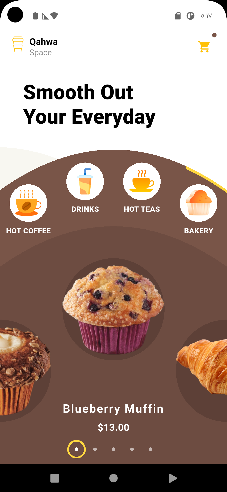

# ☕ Coffee Shop UI

**An elegant Coffee Shop UI** built with Flutter.

  


## Screenshots



## Features
- Curved header with CustomClipper
- Horizontal category list
- Product cards
- Arabic (RTL) support
- Bottom navigation

## Getting Started
```bash
git clone https://github.com/Hesham3Aref/Coffee_App_UI.git
cd Coffee_App_UI
flutter pub get
flutter run
