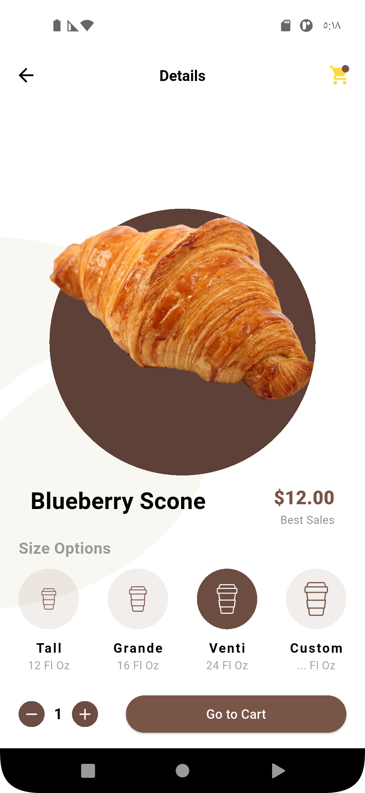
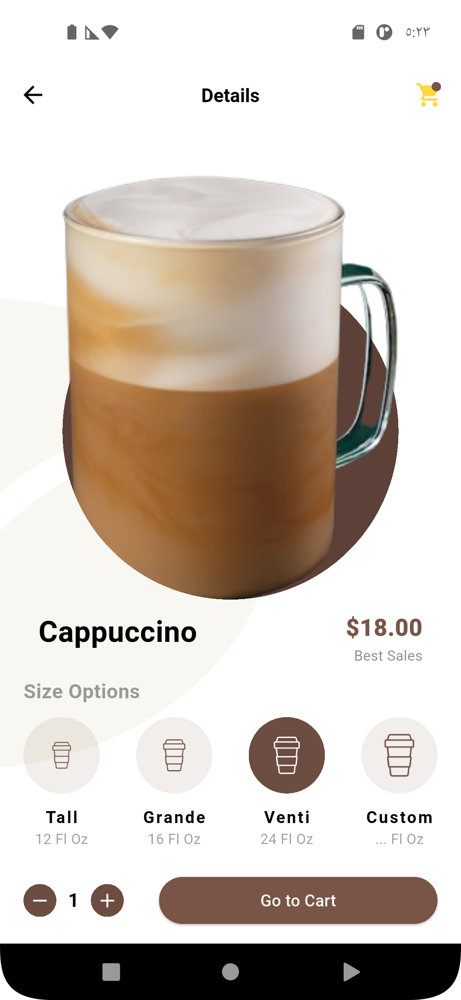

# ☕ Coffee Shop UI - Flutter App

A beautiful and modern **Coffee Shop UI** built with **Flutter**.

This project showcases a custom and elegant front-end design ideal for coffee or beverages apps. The UI is fully responsive and supports **Arabic localization**, making it suitable for right-to-left (RTL) languages.

---

## 📱 Screenshots

---

## ✨ Features

- 🎨 Custom curved top header using `CustomClipper`
- 📂 Horizontally scrollable category list (Coffee, Tea, Juice...)
- 🧋 Beautiful item cards with images, name, and prices
- 🌐 Arabic language UI support (RTL layout)
- 🧭 Modern bottom navigation bar
- ⚙️ Clean, organized, and scalable code structure

---

## 🚀 Getting Started
